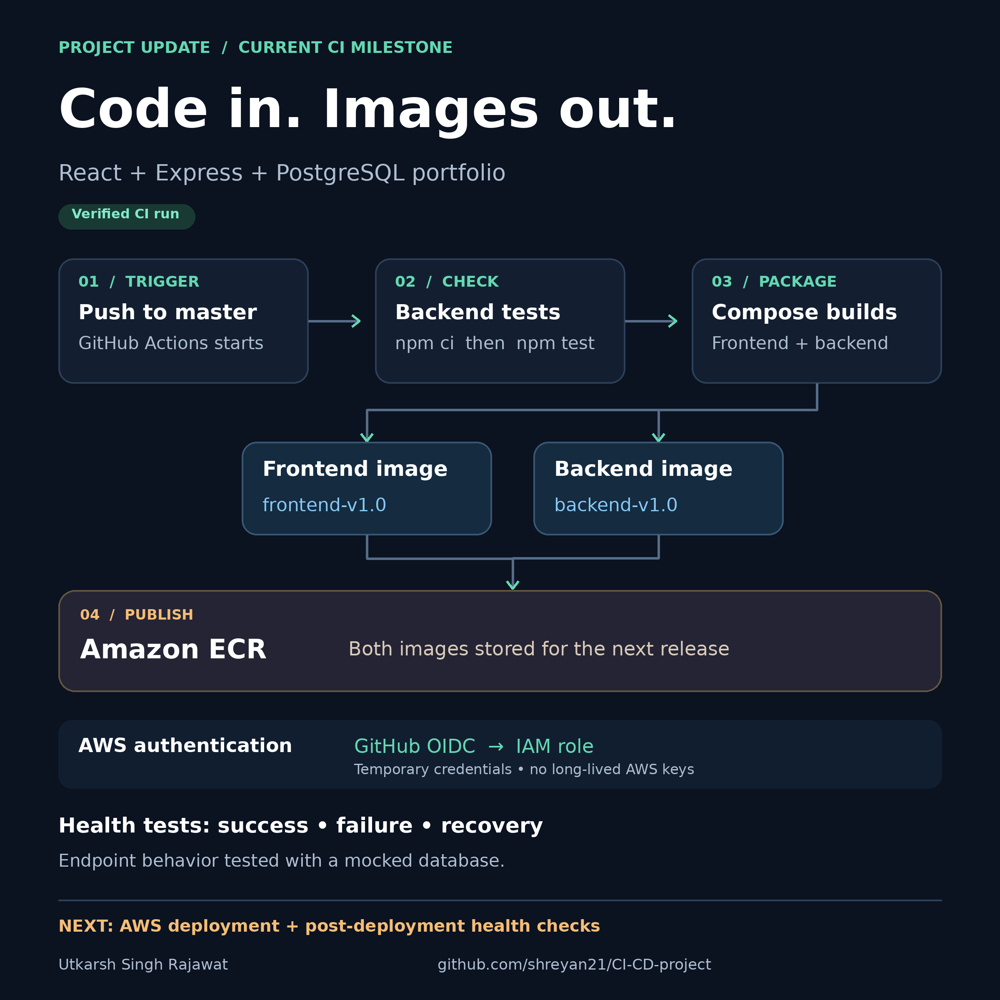
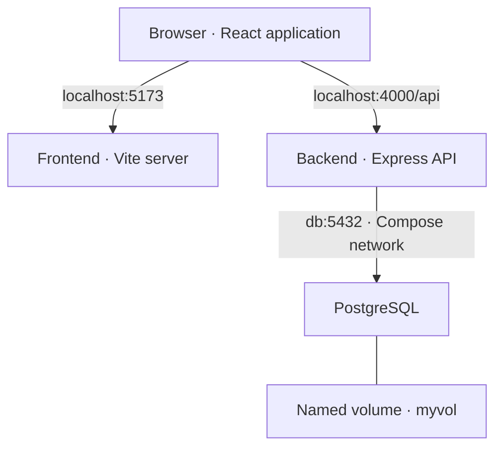

# Portfolio DevOps · CI to Amazon ECR

A personal React + Express + PostgreSQL portfolio, used to practise automated testing, Docker builds and AWS image publishing.

**Current milestone:** pushes to `master` run backend health tests, build two application images and publish them to Amazon ECR. EC2 deployment, Terraform provisioning and monitoring are the next stages.

[Workflow source](.github/workflows/ci.yml) · [Actions history](https://github.com/shreyan21/CI-CD-project/actions) · [Verified successful run](https://github.com/shreyan21/CI-CD-project/actions/runs/37977325973)



## Contents

- [Current status](#current-status)
- [Application architecture](#application-architecture)
- [Run locally](#run-locally)
- [Tests and builds](#tests-and-builds)
- [GitHub Actions and AWS](#github-actions-and-aws)
- [Repository map](#repository-map)
- [Known limitations and next steps](#known-limitations-and-next-steps)

## Current status

| Area | What is implemented |
| --- | --- |
| Application | React/Vite frontend, Express API, PostgreSQL migrations and seed scripts; public portfolio and skills admin UI. |
| Containers | Frontend and backend Dockerfiles; three Compose services and a named database volume. Both images currently run development servers. |
| CI | GitHub Actions on pushes to `master`; `npm ci` and `npm test` in `backend/`; `docker compose build`. |
| Registry | Both application images pushed to ECR in the verified successful run above. |
| AWS authentication | GitHub OIDC assumes an IAM role; the workflow does not use long-lived AWS access-key inputs. |
| Deployment and operations | EC2 deployment, Terraform, monitoring, rollback and database restore evidence remain planned. |

The linked run is evidence of tests, image builds and publishing. It is not evidence of a deployed website or a live database integration test.

## Application architecture

The React application runs in the user's browser and makes HTTP requests to Express. Express reads portfolio data from PostgreSQL. Compose provides the container network.



| Local URL | Purpose |
| --- | --- |
| `http://localhost:5173` | Public portfolio |
| `http://localhost:5173/admin` | Skills admin UI |
| `http://localhost:4000/health` | Live API/database health check |
| `http://localhost:4000/api/profile` | Profile JSON |
| `http://localhost:4000/api/skills` | Skills JSON |
| `http://localhost:4000/api/experience` | Experience JSON |
| `http://localhost:4000/api/certifications` | Certifications JSON |

The backend uses the Compose service name `db`. The browser uses `localhost`, not the container service name `backend`. Keep frontend and API hostnames consistent when testing admin cookies.

## Run locally

Requirements: Git, Docker Engine/Desktop with Compose v2, and Node.js 24 if running commands outside containers.

The commands below use a Bash-compatible terminal and start a **local development environment**.

### 1. Clone and configure

```bash
git clone https://github.com/shreyan21/CI-CD-project.git
cd CI-CD-project
```

Create `backend/.env` and `frontend/.env` from their `.env.example` templates if you do not already have local configuration. Review existing files before overwriting them.

In `docker-compose.yml`, choose a local database password. Match `backend/.env` to the Compose database user, password and database name:

```dotenv
PORT=4000
DATABASE_URL=postgresql://admin:YOUR_LOCAL_DB_PASSWORD@db:5432/utkarsh_portfolio
FRONTEND_ORIGIN=http://localhost:5173
PGSSL=false
DB_POOL_SIZE=10
SESSION_SECRET=REPLACE_WITH_A_RANDOM_VALUE_OF_AT_LEAST_32_CHARACTERS
COOKIE_SECURE=false
```

Generate a session secret locally:

```bash
node -e "console.log(require('node:crypto').randomBytes(48).toString('base64url'))"
```

Set `frontend/.env` to:

```dotenv
VITE_API_URL=http://localhost:4000/api
```

The checked-in backend example uses different database credentials from Compose; copying it alone is insufficient. Use your own configuration and do not commit secrets.

### 2. Build, start the database and initialize data

```bash
docker compose build
docker compose up -d db
docker compose exec db sh -c 'pg_isready -U "$POSTGRES_USER" -d "$POSTGRES_DB"'
```

Wait until the readiness command reports that PostgreSQL is accepting connections. Then:

```bash
docker compose run --rm --no-deps backend npm run db:init
docker compose up -d backend frontend
docker compose ps
```

`db:init` runs migrations and seed data. The current seed uses guarded/conflict-safe inserts to preserve existing rows. For an existing database, migrations can be run separately with `npm run db:migrate`.

### 3. Verify the actual API

```bash
curl --fail http://localhost:4000/health
curl --fail http://localhost:4000/api/profile
curl --fail http://localhost:4000/api/skills
```

Then open the public portfolio. A fallback page alone does not prove database connectivity; inspect the API responses and the page's data-source/error state.

Optional: create or reset the local admin account:

```bash
docker compose exec backend npm run auth:reset -- admin
```

This prompts for a password, stores its hash in PostgreSQL and invalidates existing sessions for that username. Admin access uses a database-backed session, an HTTP-only SameSite cookie and a CSRF token.

### 4. Inspect and stop

```bash
docker compose logs --tail=100 backend
docker compose logs --tail=100 frontend
docker compose down
```

The named volume is retained by `docker compose down`. Adding `--volumes` removes it and its database data.

## Tests and builds

Run the same backend test command as CI on the host:

```bash
cd backend
npm ci
npm test
cd ..
```

The checked-in suite contains three HTTP health tests with a **stubbed database**:

1. A successful query returns HTTP 200 and connected database status.
2. A failed query returns HTTP 500 without exposing internal error details.
3. A later successful query recovers after a temporary failure.

PostgreSQL is not needed for this suite. It validates endpoint behaviour, not a real PostgreSQL connection. CI currently uses Node.js 20; the application Dockerfiles use Node.js 24.

For a separate frontend production-build check:

```bash
cd frontend
npm ci
npm run build
cd ..
```

That frontend build command is available locally but is **not a separate step in the current CI workflow**. The frontend Dockerfile starts Vite's development server.

The `test:integration` script currently references a missing `backend/test/integration.test.js`. Do not treat it as a working integration suite until that file is implemented.

## GitHub Actions and AWS

Source: [`.github/workflows/ci.yml`](.github/workflows/ci.yml).

| Configuration | Current behaviour |
| --- | --- |
| Trigger | Every push to `master`; no pull-request trigger yet. |
| Runner | `ubuntu-latest` |
| Permissions | `contents: read` and `id-token: write` |
| Repository variables | `AWS_ROLE_ARN`, `AWS_REGION` |
| AWS login | OIDC role assumption followed by ECR login |
| Checks | Backend `npm ci`, then `npm test` |
| Packaging | `docker compose build` for frontend and backend |
| Publishing | Both images pushed to the ECR repository `my-ecr` |
| Image tags | `backend-v1.0`, `frontend-v1.0` |
| Deployment | No EC2/SSM deployment step in this workflow yet. |

To use the workflow in your own AWS account:

- Create the ECR repository and an IAM role with the required ECR push permissions.
- Configure the IAM role's OIDC trust for your repository and `master` branch.
- Set `AWS_ROLE_ARN` and `AWS_REGION` under repository **Settings → Secrets and variables → Actions → Variables**.
- Replace the hard-coded registry/repository URLs in the tag and push commands. Changing `AWS_REGION` alone does not update those URLs.
- Keep AWS credentials and session secrets out of source control.

ECR stores the images. A separate deployment step is needed to run a new version on EC2. ECR storage and later AWS compute/monitoring can incur charges.

## Repository map

| Location | Responsibility |
| --- | --- |
| `frontend/` | React/Vite UI, admin panel and frontend Dockerfile |
| `backend/src/` | Express routes, database access, authentication and validation |
| `backend/migrations/` | Versioned schema changes |
| `backend/sql/seed.sql` | Initial portfolio data |
| `backend/test/health.test.js` | Mocked health-endpoint tests |
| `docker-compose.yml` | Local frontend, backend and PostgreSQL services |
| `.github/workflows/ci.yml` | Test, build and ECR publishing workflow |
| `docs/architecture/` | Pipeline diagram in PNG and editable SVG |

Component guides: [backend](backend/README.md) and [frontend](frontend/README.md).

## Known limitations and next steps

- **Secrets:** `.env` files are currently tracked. Remove them from tracking, ignore future local environment files and rotate any real exposed credentials. Removing the latest file does not erase Git history.
- **Local database configuration:** Compose includes a development password, publishes port 5432 and uses an unpinned `postgres` image. Use controlled versions and private database access before public deployment.
- **Development images:** replace Vite/Node watch-mode images with production serving and runtime configurations.
- **Repeatable releases:** replace reused `v1.0` tags with commit-SHA tags or digests.
- **CI coverage:** add pull-request checks, a frontend production-build step and real database integration tests. Align Node versions.
- **Operations:** add Terraform-managed AWS infrastructure, an explicit deployment command, health verification, monitoring, rollback and a tested PostgreSQL backup/restore.

This is an evolving personal project. Completed milestones are backed by repository code and linked workflow evidence; planned work is listed separately.

